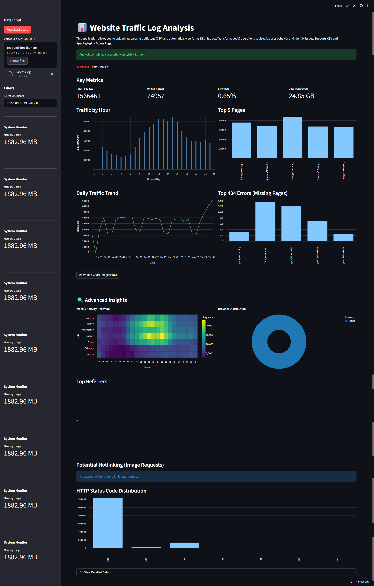
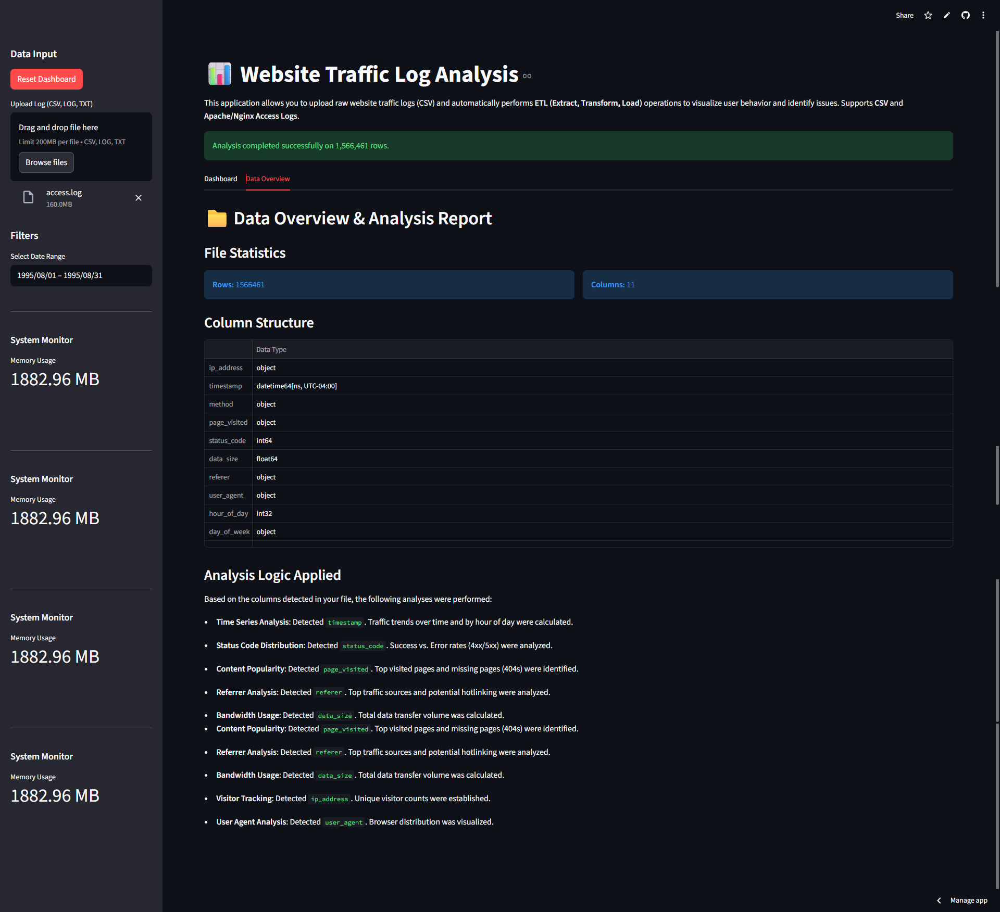

# Website Traffic Log Analysis

[](https://www.python.org/downloads/)
[](https://streamlit.io)
[](LICENSE)

A robust Data Engineering project that demonstrates **ETL (Extract, Transform, Load)** processes on website traffic logs. This project includes a Jupyter Notebook for educational walkthroughs and a live interactive **Streamlit** dashboard for real-time log analysis.

**🔴 Live App:** [https://websitetrafficloganalyzer.streamlit.app/](https://websitetrafficloganalyzer.streamlit.app/)

## Features

### 🛡️ Security & Compliance
*   **IP Anonymization**: Optional hashing of IP addresses (SHA-256) for GDPR compliance.
*   **Rate Limiting**: Prevents abuse by limiting request frequency.
*   **Input Sanitization**: Validates uploaded files to reject binary/malicious content.

### Performance & Scalability
*   **Chunked Processing**: Handles large CSV and Log files efficiently by processing data in chunks.
*   **Vectorized Operations**: Optimized Pandas transformations for high-speed parsing.
*   **Memory Management**: Real-time system monitoring and aggressive garbage collection to prevent crashes.

### Advanced Analytics
*   **Granular Error Analysis**: Distinguishes between Client Errors (4xx) and Server Errors (5xx).
*   **Anomaly Detection**: Statistical analysis (Z-score) to flag unusual traffic spikes.
*   **Traffic Heatmaps**: Visualizes peak activity times by Day of Week and Hour.
*   **User Agent Parsing**: Identifies browser and bot traffic distribution.

### Core Functionality
*   **Multi-Format Support**: Upload standard **CSV** files or raw **Apache/Nginx Access Logs** (`.log`, `.txt`).
*   **Interactive Dashboard**:
    *   **Key Metrics**: Total requests, unique visitors, bandwidth usage, and error rates.
    *   **Content Insights**: Identify top visited pages and top referring websites.
    *   **Security**: Detect potential image hotlinking from external domains.
*   **Data Overview**:
    *   **Quality Metrics**: Null value percentages and column data types.
    *   **Analysis Log**: Dynamic summary of performed analyses based on detected columns.
*   **Export Options**: Download processed data (CSV) and individual charts (PNG).

## Screenshots

### 1. Main Dashboard


### 2. Data Overview


## Project Structure

*   `app.py`: The main entry point for the Streamlit web application. Contains the logic for the dashboard and log parsing.
*   `website_traffic_analysis.ipynb`: A Jupyter Notebook serving as a prototyping environment. It breaks down the logic step-by-step for learning purposes.
*   `requirements.txt`: List of Python dependencies required to run the project.
*   `.streamlit/config.toml`: Server configuration for upload limits.

## 🧪 Sample Datasets
To test the application, you can use these datasets:
1.  **NASA HTTP Access Logs**: [Kaggle Link (Raw Logs)](https://www.kaggle.com/datasets/adchatakora/nasa-http-access-logs?select=access.log)
2.  **NASA Dataset for LSTM**: [Kaggle Link (Processed CSV)](https://www.kaggle.com/datasets/pasanbhanuguruge/nasa-http-logs-dataset-processed-for-lstm-models?select=NASA+Dataset+for+LSTM.csv)

## 🛠️ Installation

1.  **Prerequisites**: Ensure you have Python 3.7+ installed.

2.  **Install Dependencies**:
    Open your terminal or command prompt in the project directory and run:
    ```bash
    pip install -r requirements.txt
    ```

## 📊 Usage

### Running the Web Application
To launch the interactive dashboard:

```bash
streamlit run app.py
```

Once running, a local URL (usually `http://localhost:8501`) will open in your browser. You can upload your log files directly via the sidebar.

### Running the Notebook
To explore the code logic and step-by-step analysis:
1.  Open the notebook in VS Code or Jupyter Lab:
    ```bash
    jupyter notebook website_traffic_analysis.ipynb
    ```
2.  Run the cells sequentially to see how data is loaded, cleaned, and analyzed.

## 📝 Data Format Support

### 1. CSV Format
If uploading a CSV, it should contain the following headers:
`timestamp`, `ip_address`, `page_visited`, `status_code`, `user_agent`

### 2. Apache/Nginx Log Format
The app supports the **Combined Log Format** and **Common Log Format**.
Example:
```text
127.0.0.1 - - [10/Oct/2023:13:55:36 +0000] "GET /home HTTP/1.1" 200 2326 "http://google.com" "Mozilla/5.0..."
```

## Analysis Breakdown

1.  **Unique Visitors**: Counted based on unique IP addresses.
2.  **Error Rate**: Percentage of requests returning 4xx or 5xx status codes.
3.  **Hotlinking**: Identifies external domains (Referers) requesting image files (png, jpg, etc.) from your server.
4.  **Bandwidth**: Sums up the size of data transferred in responses.

## License

This project is open-source and available for educational purposes.